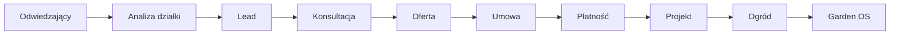
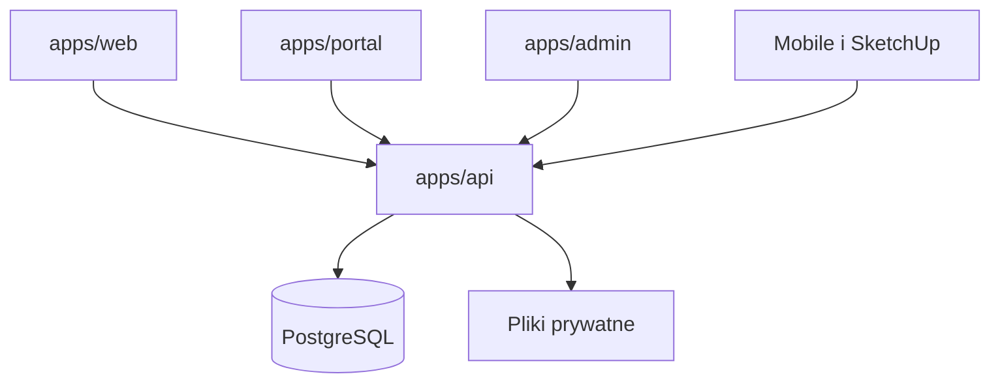

# Forma Zieleni

System pracowni architektury krajobrazu: od wejścia na stronę, przez ofertę i projekt, do ogrodu, który zostaje po realizacji.

Jedno Core API trzyma stan. Strona publiczna, portal klienta i panel pracowni są osobnymi aplikacjami i osobnymi strefami zaufania. Agent nie jest źródłem prawdy. Ograniczeniem pracowni jest czas właściciela i projektanta, więc system ma podnosić jakość popytu i wartość godziny pracy, nie samą liczbę leadów.

[](package.json)
[](package.json)
[](contracts/openapi.json)

> [!NOTE]
> Architektura Gate A jest zdecydowana od 2026-09-21. Pion leadów działa w `apps/api`. Strona, portal i panel pracowni nie są zbudowane. To nie jest akceptacja bezpieczeństwa. Aktualny zapis stanu: [`docs/architecture/GATE-IMPLEMENTATION-CHECKPOINT.md`](docs/architecture/GATE-IMPLEMENTATION-CHECKPOINT.md).

## Spis

- [Cykl pracy](#cykl-pracy)
- [Co jest zbudowane](#co-jest-zbudowane)
- [Układ wykonania](#układ-wykonania)
- [Mapa repozytorium](#mapa-repozytorium)
- [Uruchomienie lokalne](#uruchomienie-lokalne)
- [Od czego zacząć czytanie](#od-czego-zacząć-czytanie)
- [Czego ten opis nie rozstrzyga](#czego-ten-opis-nie-rozstrzyga)
- [Integralność](#integralność)

## Cykl pracy



Oferta jest obiektem z zakresem, wyłączeniami, ceną, ważnością, harmonogramem i powiązaniem z umową. Wejście w realizację idzie ścieżką oferta, akceptacja, umowa, zaliczka albo płatność, projekt. Podpis, gdy umowa go wymaga, stoi między umową a płatnością. Dostawca podpisu nie jest wybrany: [`docs/architecture/FZ-SIGN-1-CONTRACT-LIFECYCLE.md`](docs/architecture/FZ-SIGN-1-CONTRACT-LIFECYCLE.md).

Garden OS ma być trwałym zapisem ogrodu po oddaniu projektu: działka, projekt, rośliny, materiały, pielęgnacja, pogoda, zdjęcia i historia. Tego zapisu jeszcze nie ma w kodzie.

## Co jest zbudowane

| Obszar | Teraz | Jeszcze nie |
| --- | --- | --- |
| Core API | Hono na Node 24. Publiczne przyjęcie leada, lista, odczyt i kwalifikacja. Sesje Better Auth. Uprawnienia w Core API. Jednorazowe wysłanie outboxa. PostgreSQL przez Kysely. | Nadzorowany worker. ZAP. Dependency-Check. |
| Strona, portal, panel | Framework wybrany: React Router. Katalogi `apps/web`, `apps/portal`, `apps/admin` istnieją. | Same aplikacje. |
| Kontrakt | OpenAPI 3.0.4 w `contracts/openapi.json`. Testy kontraktu. | Wygenerowany klient HTTP. Klient Ruby dla SketchUp. |
| Domena | Reguły tworzenia i kwalifikacji leada w `packages/domain`. | Reszta CRM, sprzedaży, projektów i płatności. |
| Tożsamość | Better Auth w procesie API. Stabilne `actorId`. | Osobny dostawca tożsamości. |
| Pliki | Lokalny, prywatny magazyn poza gitem. | Produkcyjny magazyn obiektów. Garage jest tylko kierunkiem na staging. |
| Wejście z sieci | Localhost. | Cloudflare Tunnel. Żaden tunel nie został utworzony. |
| CMS | Apostrophe na PostgreSQL, ADR-015. Forma Zieleni trzyma potok mediów. | CMS-ACCEPT. Laboratorium w `labs/fz-cms-1` jest dowodem, nie akceptacją. |
| Wyszukiwanie | Architektura w [`docs/architecture/FZ-SEARCH-1.md`](docs/architecture/FZ-SEARCH-1.md). | Polityka crawlera treningowego. Żywy OAuth do konta firmy jest poza zakresem lokalnej pracy. |
| Mobile i SketchUp | Mają konsumować kontrakt Core API. | Implementacja. |

Szczegóły pionu leadów, w tym to, czego endpointy nie robią: [`apps/api/README.md`](apps/api/README.md).

## Układ wykonania



WWW, portal i panel nie są prawdą domenową. Mogą być tylko adapterami do Core API. Android, iOS, SketchUp i późniejsi agenci też czytają kontrakt API, nie wnętrze frontu.

Zdecydowany stos, zapisany w [`docs/architecture/CURRENT-ARCHITECTURE.md`](docs/architecture/CURRENT-ARCHITECTURE.md):

- Node 24, pnpm 10, Turborepo.
- PostgreSQL i Kysely. Bez ORM.
- Outbox transakcyjny.
- Better Auth teraz. Autoryzacja obiektów zostaje w Core API.
- Obserwowalność zgodna z OpenTelemetry i logi JSON. OpenObserve jest na późniejszy staging linuksowy, nie na tę stację Windows.
- Sekrety lokalne poza gitem. Kierunek na materiał szyfrowany przy repozytorium: SOPS i age.
- Kopia zapasowa nie jest uznana, dopóki odtworzenie nie jest sprawdzone.
- Rozwój teraz: natywny Windows. Docker nie jest warunkiem pracy lokalnej. Docker Compose jest modelem późniejszego stagingu na Linuxie.
- Produkcyjny host obliczeniowy nie jest wybrany.

## Mapa repozytorium

| Ścieżka | Rola |
| --- | --- |
| `apps/api` | Core API i pion leadów. |
| `apps/web` | Strona publiczna. Katalog bez aplikacji. |
| `apps/portal` | Portal klienta. Katalog bez aplikacji. |
| `apps/admin` | Panel pracowni. Katalog bez aplikacji. |
| `packages/domain` | Reguły domenowe. |
| `packages/validation` | Walidacja wejścia. |
| `packages/types` | Typy współdzielone. |
| `packages/api-client` | Ścieżki klienta. To nie jest wygenerowany transport HTTP. |
| `packages/media` | Potok mediów. Nie jest akceptacją CMS. |
| `contracts/openapi.json` | Kontrakt HTTP. |
| `labs/fz-cms-1` | Laboratorium CMS. |
| `docs/` | Kanon i decyzje. Indeks: [`docs/README.md`](docs/README.md). |
| `legacy/` | Materiał źródłowy. Nie nadpisuje kanonu. |

## Uruchomienie lokalne

Wymagane: Node.js 24 lub nowszy oraz pnpm 10.33.2 (`packageManager` w `package.json`).

```text
pnpm install
pnpm lint
pnpm typecheck
pnpm test
pnpm repo:check
```

`pnpm test` sprawdza reguły, kontrakt i HTTP. Test integracyjny PostgreSQL startuje tymczasowy klaster, gdy na `PATH` są `initdb` i `pg_ctl`, albo gdy ustawiono `LEAD_DATABASE_URL`. Brak obu warunków pomija test persystencji. Pominięcie nie jest zaliczeniem.

Uruchomienie samego API wymaga już działającego PostgreSQL i zmiennych opisanych w [`apps/api/README.md`](apps/api/README.md). Ten pakiet nie instaluje Dockera. Proces słucha na `127.0.0.1`.

## Od czego zacząć czytanie

Dokumenty wiążące są po angielsku. Kolejność:

1. [`docs/constitution/PROJECT-CONSTITUTION.md`](docs/constitution/PROJECT-CONSTITUTION.md)
2. [`docs/vision/PRODUCT-CANON.md`](docs/vision/PRODUCT-CANON.md) i [`docs/vision/MASTER-PLAN.md`](docs/vision/MASTER-PLAN.md)
3. [`docs/architecture/CURRENT-ARCHITECTURE.md`](docs/architecture/CURRENT-ARCHITECTURE.md)
4. [`START-HERE-CURSOR.md`](START-HERE-CURSOR.md), jeśli pracujesz w tym repozytorium z Cursora
5. [`docs/DOCUMENTATION-MAP.md`](docs/DOCUMENTATION-MAP.md), gdy szukasz jednego dokumentu, a nie całego drzewa

Nie zaczynaj od `legacy/`. Nie wybieraj stamtąd frameworka, bazy, hostingu ani magazynu.

## Czego ten opis nie rozstrzyga

- Dostawca płatności.
- Silnik podpisu elektronicznego.
- Host produkcyjny.
- Produkcyjny magazyn obiektów.
- Polityka produkcyjnego crawlera treningowego: [`docs/architecture/OWNER-DECISION-PACKET-FZ-SEARCH-CRAWL-1.md`](docs/architecture/OWNER-DECISION-PACKET-FZ-SEARCH-CRAWL-1.md).

CMS jest zdecydowany w [`docs/architecture/OWNER-DECISION-PACKET-FZ-CMS-1.md`](docs/architecture/OWNER-DECISION-PACKET-FZ-CMS-1.md). Ta decyzja nie jest CMS-ACCEPT.

Praca idzie wprost na `main`. Nie otwieraj pull requesta tylko po to, żeby uruchomić recenzję.

## Integralność

`pnpm repo:check` liczy SHA-256 śledzonych plików i porównuje je z [`SHA256SUMS.txt`](SHA256SUMS.txt). Manifest odtwarza się tylko przez `node scripts/repo-integrity.mjs --write`.

`FILE-MANIFEST-SHA256.txt` oraz kopie w `docs/knowledge/freset-v2-reference/` i `legacy/` są zamrożonym pochodzeniem, nie obrazem aktualnego drzewa. Znaczenie sum: [`docs/engineering/REPOSITORY-INTEGRITY.md`](docs/engineering/REPOSITORY-INTEGRITY.md).

Do gita nie wchodzą sekrety, klucze, dane klientów ani zrzuty. Wymagania bezpieczeństwa: [`docs/architecture/SECURITY.md`](docs/architecture/SECURITY.md).

W repozytorium nie ma pliku licencji. Pakiety npm są oznaczone jako prywatne. Brak licencji nie jest zgodą na kopiowanie kodu.
