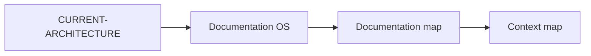

# FZ Documentation OS

Status: CURRENT subordinate Canon. The architecture entrypoint remains
[`CURRENT-ARCHITECTURE.md`](./CURRENT-ARCHITECTURE.md). This file does
not add an execution loop, a learning system, or a roadmap.

The product execution graph remains
[`NEXT-SLICES-CMS.md`](./NEXT-SLICES-CMS.md). Learning remains
[`FZ-CONTINUOUS-IMPROVEMENT.md`](./FZ-CONTINUOUS-IMPROVEMENT.md).
The map of documents is [`../DOCUMENTATION-MAP.md`](../DOCUMENTATION-MAP.md).
Pointers for agents are [`../engineering/FZ-CONTEXT-MAP.json`](../engineering/FZ-CONTEXT-MAP.json).

## What documentation is for

A document exists for a named reader and a task: decide, operate, implement,
or recover. Page count is not a quality measure.

## Single source

Machine facts stay in their machine home.

| Fact | Home |
| --- | --- |
| Lead and plan HTTP shape | `contracts/openapi.json` |
| Database constraints | `apps/api/src/db.ts` |
| Business rules | `packages/domain` |
| Architecture decision | this `docs/architecture` tree and ADRs |
| Marketing plan behavior | [`FZ-GROWTH-OS.md`](./FZ-GROWTH-OS.md) and `packages/domain/src/growth.ts` |
| Requirements | `scripts/requirements/registry.mjs` |
| Test result | the test run, not a prose claim |

Link to that home. Copy a fact only when a reader cannot follow the link,
and name the home in the same paragraph.

## Owners

An owner is a role, not a person invented for the page. The catalog in
`docs/engineering/documentation-catalog.json` names the role. Ownership
means the role is accountable for correctness. It does not reserve the
edit right.

## Reader needs

Use a type when it helps a reader: CANON, GUIDE, REFERENCE, EXPLANATION,
RUNBOOK, EVIDENCE. Do not create empty tutorial, how-to, reference, and
explanation copies of the same page.

## Impact check

The DOCUMENT stage of the Cursor OS loop asks whether the slice changed
behavior, a contract, security, privacy, operations, or an operator
workflow. If it did, update the canonical page in the same slice. If it
did not, "no material documentation impact" is a valid result.

## Quality

Dimensions, kept separate, with no combined score: reliability,
understandability, findability, coverage, organization, change
synchronization, accuracy, incident usefulness. The honest baseline is
[`../engineering/DOCUMENTATION-QUALITY-BASELINE.md`](../engineering/DOCUMENTATION-QUALITY-BASELINE.md).

DORA's five delivery metrics are not documentation metrics. DocumentationOps
is a separate operations list: broken links, stale binding pages, missing
owners, and context-map gaps. It is not a productivity count of pages or commits.

## Documentation debt

Documentation debt is a material gap: a binding page is missing, wrong,
dangerously stale, or not findable, and the fix is not done. Typos are not
debt. Debt is carried in the execution journal and in
[`NEXT-SLICES-CMS.md`](./NEXT-SLICES-CMS.md). It is not a second backlog.

A repeated documentation failure can become an FZ-CIS record through
`scripts/docs/learning.mjs`. The record starts as OBSERVED. It cannot
promote itself into Canon.

## State words

When a sentence could be read as live product behavior, mark it CURRENT,
DESIGNED, CONTRACT_READY, PRODUCTION_ONLY, or OWNER_GATED. A designed
screen is not an operational screen.

## Public repository

Documents in git are public. Do not write secrets, customer data, or
private contracts. Guides use synthetic examples and say so.

## Context for agents

Read [`../DOCUMENTATION-MAP.md`](../DOCUMENTATION-MAP.md), then the context
map entry for the task. Do not load the whole tree because a context window
is large. After compaction, start from `START-HERE-CURSOR.md` and the
recovery list in the context map.

## Diagram

The diagram is a finding aid. The tables above are the rule.
